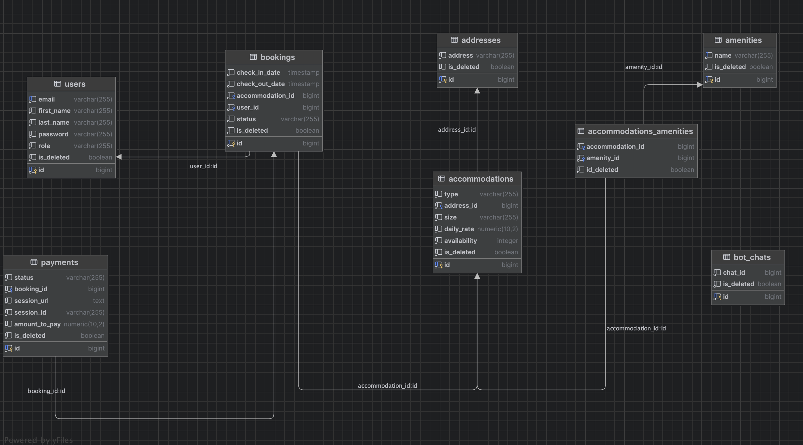

<body>
    <header>
        
        <h1 style="position: absolute; top: 50px; left: 50%; transform: translate(-50%); color: black;">
            Accommodation booking service
        </h1>
        

            Welcome to the Accommodation Booking Service! Our platform is revolutionizing the rental process, providing a convenient and efficient experience for both seekers and administrators.
            For users, it's a straightforward journey from registration to booking their chosen accommodation. The user-friendly interface offers detailed information about each property, including type, location, size, amenities, daily rates, and real-time availability.
            For administrators, a powerful toolkit streamlines the management of the housing inventory. Adding, updating, and removing properties is a breeze, with instant availability information.
            Booking is under user control. From creating and managing bookings to modifications – it's all in the hands of the user. Administrators also easily access booking information for effective management.
            This is just a glimpse of how our service transforms the rental experience. Thank you for your understanding.
        

        

            <a href="#technologies">Technologies used</a> <> 
            <a href="#how_to_use">How to use</a> <> 
            <a href="#entities">Entities</a> <> 
            <a href="#database-structure">Database Structure</a> <> 
            <a href="#endpoints">Endpoints</a> <> 
            <a href="#swagger">Swagger</a> <> 
            <a href="#notification">Notification</a>
        

    </header>
    

        <h2>Technologies used</h2>
        <ul>
            <li>
                 Java 17+
            </li>
            <li>
                Maven
            </li>
            <li>
                 Spring Boot 
            </li>
            <li>
                 Spring Data JPA 
            </li>
            <li>
                   Spring Boot Security 
            </li>
            <li>
                 JSON Web Token
            </li>
            <li>
                 Lombok 
            </li>
            <li>
                 MapStruct 
            </li>
            <li>
                 Liquibase
            </li>
            <li>
                 PostgreSQL 16 
            </li>
            <li>
                 Hibernate
            </li>
            <li>
                 JUnit5
            </li>
            <li>
                 Testcontainers
            </li>
            <li>
                 Docker
            </li>
            <li>
                 Swagger
            </li>
            <li>
                 Stripe API
            </li>
            <li>
                 Telegram API
            </li>
            <li>
                 Postman
            </li>
        </ul>
    

    

        <h2>How to use the project</h2>
        <h5>1. Before you start, make sure you have installed:</h5>
        <ul>
            <li>
                 JDK 17+
            </li>
            <li>
                 Docker
            </li>
        </ul>
        <h5>2. Clone repository</h5>
        <pre>git clone https://github.com/MarynaKushniruk/jv-accommodation-booking-service.git</pre>
        <h5>3.Create an .env file in the root directory</h5>
        
See an example of a sample <code>.env-sample</code>

        <h5>4.Run these commands to create a docker container and run the image</h5>
        <pre>docker-compose build</pre>
        <pre>docker-compose up</pre>
        <h5>5. Now whatever port you specified in SPRING_LOCAL_PORT, the program will run on that port</h5>
        <pre>example - http://localhost:8088</pre>
        <h3>General use</h3>
        <h5>6.There are already 2 users saved in the database:</h5>
        

            User with role CUSTOMER  
            <pre>email - customer@example.com password - 987654321</pre> 
            User with role MANAGER  
            <pre>email - manager@example.com password - 123456789</pre> 
            to use the endpoints, can you register a new user.
        

        <h5>7.How to use payment endpoints</h5>
        

            When you go to the session initialization endpoint, you will need to pass your card for payment, in test mode we use <code>card_token</code>, for that follow this link
        

            <pre>https://stripe.com/docs/testing?testing-method=tokens#pagos-rechazados</pre>
        

            select the card you like and go to the <code>Tokens</code> tab, maybe something like this: <code>tok_visa</code>
        

        

        You can use these provided card tokens:
        <pre>tok_visa tok_mastercard tok_visa_chargeDeclined</pre>
        

    

    

        <h2>Entities</h2>
        <h4>User</h4>
        <pre>
The user entity represents detailed information about registered users. 
At this stage, there are only 2 roles that grant certain access rights to users, these are: customer and manager.
        </pre>
        <h4>Accommodation</h4>
        <pre>
The Accommodation entity holds crucial information about available living spaces. 
It includes details such as accommodation type (e.g., HOUSE, APARTMENT), location, size (e.g., STUDIO, ONE_BEDROOM), amenities, daily rental rate, and availability count. 
Soft deletion is implemented, allowing accommodations to be marked as deleted without permanent removal. 
This entity is fundamental to efficiently managing and offering diverse housing options within the system.
        </pre>
        <h4>Address</h4>
        <pre>
The Address entity serves as a cornerstone for storing location information within the system.
        </pre>
        <h4>Amenity</h4>
        <pre>
The Amenity entity represents various amenities available within the system. 
It incorporates fields for unique identification, amenity name, and a soft deletion flag.
        </pre>
        <h4>Booking</h4>
        <pre>
The Booking entity represents a reservation made within the system. 
It includes information such as a unique identifier, check-in and check-out dates, the associated accommodation, 
the user making the booking, booking status, and a soft deletion flag.
        </pre>
        <h4>Payment</h4>
        <pre>
The Payment entity encapsulates information about a financial transaction. It includes a unique identifier, payment status (e.g., PENDING, PAID), 
associated booking ID, session URL for payment processing, session ID, payment amount, and a soft deletion flag for improved data management.
        </pre>
    

    

        <h2> Database structure</h2>
        
    

    

        <h2>Endpoints</h2>
        <h3>Authentication Management</h3>
        <table>
            <tr>
                <th style="border: 1px solid #dddddd; text-align: left; padding: 8px;">HTTP Request</th>
                <th style="border: 1px solid #dddddd; text-align: left; padding: 8px;">Endpoints</th>
                <th style="border: 1px solid #dddddd; text-align: left; padding: 8px;">Security requirement</th>
                <th style="border: 1px solid #dddddd; text-align: left; padding: 8px;">Description</th>
            </tr>
            <tr>
                <td style="border: 1px solid #dddddd; text-align: left; padding: 8px;">POST</td>
                <td style="border: 1px solid #dddddd; text-align: left; padding: 8px;">/api/auth/register</td>
                <td style="border: 1px solid #dddddd; text-align: left; padding: 8px;">None</td>
                <td style="border: 1px solid #dddddd; text-align: left; padding: 8px;">Allows users to register a new account.</td>
            </tr>
            <tr>
                <td style="border: 1px solid #dddddd; text-align: left; padding: 8px;">POST</td>
                <td style="border: 1px solid #dddddd; text-align: left; padding: 8px;">/api/auth/login</td>
                <td style="border: 1px solid #dddddd; text-align: left; padding: 8px;">None</td>
                <td style="border: 1px solid #dddddd; text-align: left; padding: 8px;">Login with email and password. Response - JWT token</td>
            </tr>
        </table>
        <h3>User Management</h3>
        <table>
            <tr>
                <th style="border: 1px solid #dddddd; text-align: left; padding: 8px;">HTTP Request</th>
                <th style="border: 1px solid #dddddd; text-align: left; padding: 8px;">Endpoints</th>
                <th style="border: 1px solid #dddddd; text-align: left; padding: 8px;">Security requirement</th>
                <th style="border: 1px solid #dddddd; text-align: left; padding: 8px;">Description</th>
            </tr>
            <tr>
                <td style="border: 1px solid #dddddd; text-align: left; padding: 8px;">GET</td>
                <td style="border: 1px solid #dddddd; text-align: left; padding: 8px;">/api/users/me</td>
                <td style="border: 1px solid #dddddd; text-align: left; padding: 8px;">CUSTOMER, MANAGER</td>
                <td style="border: 1px solid #dddddd; text-align: left; padding: 8px;"> Retrieves the profile information for the currently logged-in user.</td>
            </tr>
            <tr>
                <td style="border: 1px solid #dddddd; text-align: left; padding: 8px;">PUT</td>
                <td style="border: 1px solid #dddddd; text-align: left; padding: 8px;">/api/users/{id}/role</td>
                <td style="border: 1px solid #dddddd; text-align: left; padding: 8px;">MANAGER</td>
                <td style="border: 1px solid #dddddd; text-align: left; padding: 8px;">Enables users to update their roles, providing role-based access.</td>
            </tr>
            <tr>
                <td style="border: 1px solid #dddddd; text-align: left; padding: 8px;">PUT</td>
                <td style="border: 1px solid #dddddd; text-align: left; padding: 8px;">/api/users/me</td>
                <td style="border: 1px solid #dddddd; text-align: left; padding: 8px;">CUSTOMER, MANAGER</td>
                <td style="border: 1px solid #dddddd; text-align: left; padding: 8px;">Allows users to update their profile information.</td>
            </tr>
        </table>
        <h3>Accommodation Management</h3>
        <table>
            <tr>
                <th style="border: 1px solid #dddddd; text-align: left; padding: 8px;">HTTP Request</th>
                <th style="border: 1px solid #dddddd; text-align: left; padding: 8px;">Endpoints</th>
                <th style="border: 1px solid #dddddd; text-align: left; padding: 8px;">Security requirement</th>
                <th style="border: 1px solid #dddddd; text-align: left; padding: 8px;">Description</th>
            </tr>
            <tr>
                <td style="border: 1px solid #dddddd; text-align: left; padding: 8px;">POST</td>
                <td style="border: 1px solid #dddddd; text-align: left; padding: 8px;">/api/accommodations</td>
                <td style="border: 1px solid #dddddd; text-align: left; padding: 8px;">MANAGER</td>
                <td style="border: 1px solid #dddddd; text-align: left; padding: 8px;">Permits the addition of new accommodations.</td>
            </tr>
            <tr>
                <td style="border: 1px solid #dddddd; text-align: left; padding: 8px;">GET</td>
                <td style="border: 1px solid #dddddd; text-align: left; padding: 8px;">/api/accommodations/all</td>
                <td style="border: 1px solid #dddddd; text-align: left; padding: 8px;">NONE</td>
                <td style="border: 1px solid #dddddd; text-align: left; padding: 8px;">Provides a list of available accommodations.</td>
            </tr>
            <tr>
                <td style="border: 1px solid #dddddd; text-align: left; padding: 8px;">GET</td>
                <td style="border: 1px solid #dddddd; text-align: left; padding: 8px;">/api/accommodations/{id}</td>
                <td style="border: 1px solid #dddddd; text-align: left; padding: 8px;">CUSTOMER, MANAGER</td>
                <td style="border: 1px solid #dddddd; text-align: left; padding: 8px;">Retrieves detailed information about a specific accommodation.</td>
            </tr>
            <tr>
                <td style="border: 1px solid #dddddd; text-align: left; padding: 8px;">PATCH</td>
                <td style="border: 1px solid #dddddd; text-align: left; padding: 8px;">/api/accommodations/{id}</td>
                <td style="border: 1px solid #dddddd; text-align: left; padding: 8px;">MANAGER</td>
                <td style="border: 1px solid #dddddd; text-align: left; padding: 8px;">Allows updates to accommodation details, including inventory management.</td>
            </tr>
            <tr>
                <td style="border: 1px solid #dddddd; text-align: left; padding: 8px;">DELETE</td>
                <td style="border: 1px solid #dddddd; text-align: left; padding: 8px;">/api/accommodations/{id}</td>
                <td style="border: 1px solid #dddddd; text-align: left; padding: 8px;">MANAGER</td>
                <td style="border: 1px solid #dddddd; text-align: left; padding: 8px;">Enables the removal of accommodations.</td>
            </tr>
        </table>
        <h3>Booking Management</h3>
        <table>
            <tr>
                <th style="border: 1px solid #dddddd; text-align: left; padding: 8px;">HTTP Request</th>
                <th style="border: 1px solid #dddddd; text-align: left; padding: 8px;">Endpoints</th>
                <th style="border: 1px solid #dddddd; text-align: left; padding: 8px;">Security requirement</th>
                <th style="border: 1px solid #dddddd; text-align: left; padding: 8px;">Description</th>
            </tr>
            <tr>
                <td style="border: 1px solid #dddddd; text-align: left; padding: 8px;">POST</td>
                <td style="border: 1px solid #dddddd; text-align: left; padding: 8px;">/api/bookings</td>
                <td style="border: 1px solid #dddddd; text-align: left; padding: 8px;">CUSTOMER, MANAGER</td>
                <td style="border: 1px solid #dddddd; text-align: left; padding: 8px;">Permits the creation of new accommodation bookings.</td>
            </tr>
            <tr>
                <td style="border: 1px solid #dddddd; text-align: left; padding: 8px;">GET</td>
                <td style="border: 1px solid #dddddd; text-align: left; padding: 8px;">/api/bookings/?user_id=...&status=... </td>
                <td style="border: 1px solid #dddddd; text-align: left; padding: 8px;">MANAGER</td>
                <td style="border: 1px solid #dddddd; text-align: left; padding: 8px;">Retrieves bookings based on user ID and their status.</td>
            </tr>
            <tr>
                <td style="border: 1px solid #dddddd; text-align: left; padding: 8px;">GET</td>
                <td style="border: 1px solid #dddddd; text-align: left; padding: 8px;">/api/bookings/my </td>
                <td style="border: 1px solid #dddddd; text-align: left; padding: 8px;">CUSTOMER, MANAGER</td>
                <td style="border: 1px solid #dddddd; text-align: left; padding: 8px;">Retrieves user bookings</td>
            </tr>
            <tr>
                <td style="border: 1px solid #dddddd; text-align: left; padding: 8px;">GET</td>
                <td style="border: 1px solid #dddddd; text-align: left; padding: 8px;">/api/bookings/{id}</td>
                <td style="border: 1px solid #dddddd; text-align: left; padding: 8px;">CUSTOMER, MANAGER</td>
                <td style="border: 1px solid #dddddd; text-align: left; padding: 8px;">Provides information about a specific booking.</td>
            </tr>
            <tr>
                <td style="border: 1px solid #dddddd; text-align: left; padding: 8px;">PATCH</td>
                <td style="border: 1px solid #dddddd; text-align: left; padding: 8px;">/api/bookings/{id}/td>
                <td style="border: 1px solid #dddddd; text-align: left; padding: 8px;">CUSTOMER, MANAGER</td>
                <td style="border: 1px solid #dddddd; text-align: left; padding: 8px;">Allows users to update their booking details.</td>
            </tr>
            <tr>
                <td style="border: 1px solid #dddddd; text-align: left; padding: 8px;">DELETE</td>
                <td style="border: 1px solid #dddddd; text-align: left; padding: 8px;">/api/bookings/{id}</td>
                <td style="border: 1px solid #dddddd; text-align: left; padding: 8px;">CUSTOMER, MANAGER</td>
                <td style="border: 1px solid #dddddd; text-align: left; padding: 8px;">Enables the cancellation of bookings.</td>
            </tr>
        </table>
        <h3>Payment Management</h3>
        <table>
            <tr>
                <th style="border: 1px solid #dddddd; text-align: left; padding: 8px;">HTTP Request</th>
                <th style="border: 1px solid #dddddd; text-align: left; padding: 8px;">Endpoints</th>
                <th style="border: 1px solid #dddddd; text-align: left; padding: 8px;">Security requirement</th>
                <th style="border: 1px solid #dddddd; text-align: left; padding: 8px;">Description</th>
            </tr>
            <tr>
                <td style="border: 1px solid #dddddd; text-align: left; padding: 8px;">GET</td>
                <td style="border: 1px solid #dddddd; text-align: left; padding: 8px;">/api/payments/?user_id=... </td>
                <td style="border: 1px solid #dddddd; text-align: left; padding: 8px;">MANAGER</td>
                <td style="border: 1px solid #dddddd; text-align: left; padding: 8px;">Retrieves payment information for users.</td>
            </tr>
            <tr>
                <td style="border: 1px solid #dddddd; text-align: left; padding: 8px;">POST</td>
                <td style="border: 1px solid #dddddd; text-align: left; padding: 8px;">/api/payments</td>
                <td style="border: 1px solid #dddddd; text-align: left; padding: 8px;">CUSTOMER, MANAGER</td>
                <td style="border: 1px solid #dddddd; text-align: left; padding: 8px;">Initiates payment sessions for booking transactions.</td>
            </tr>
            <tr>
                <td style="border: 1px solid #dddddd; text-align: left; padding: 8px;">GET</td>
                <td style="border: 1px solid #dddddd; text-align: left; padding: 8px;">/api/payments/success</td>
                <td style="border: 1px solid #dddddd; text-align: left; padding: 8px;">CUSTOMER, MANAGER</td>
                <td style="border: 1px solid #dddddd; text-align: left; padding: 8px;">Handles successful payment processing through Stripe redirection.</td>
            </tr>
            <tr>
                <td style="border: 1px solid #dddddd; text-align: left; padding: 8px;">GET</td>
                <td style="border: 1px solid #dddddd; text-align: left; padding: 8px;">/api/payments/cancel/</td>
                <td style="border: 1px solid #dddddd; text-align: left; padding: 8px;">CUSTOMER, MANAGER</td>
                <td style="border: 1px solid #dddddd; text-align: left; padding: 8px;">Manages payment cancellation and returns payment paused messages during Stripe redirection.</td>
            </tr>
        </table>    
    

    

        <h1>Swagger-ui usages</h1>
        

            If you will test the application locally in swagger, then after launching the application, follow this link. Use the port specified in the .env file
            <pre>http://localhost:8080/api/swagger-ui/index.html#</pre>
        

        

            This project is also uploaded to AWS server, you can follow this link and use Swagger to test the application without installing anything
            <pre>http://ec2-3-80-250-53.compute-1.amazonaws.com/api/swagger-ui/index.html#/</pre>
        

    

    

        <h1>Notification Service</h1>
        

A telegram bot was created for managers to notify them about newly created reservations and paid or canceled payments. You can join the bot when you test the application.

        <pre>https://t.me/Booking_Application_test_bot</pre>
    

    

        <h1>The video shows how the application works</h1>
        <a href="https://www.loom.com/share/88eb21a5c5154e2cac30784f21643d26?sid=85618fe3-f8d5-477b-ac1a-603cf0ee6aeb">Watch video loom </a>
    

</body>
